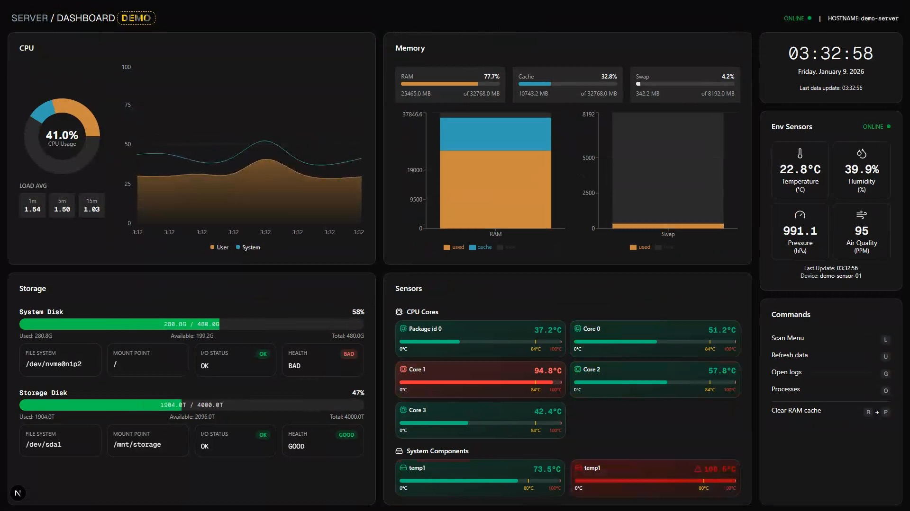
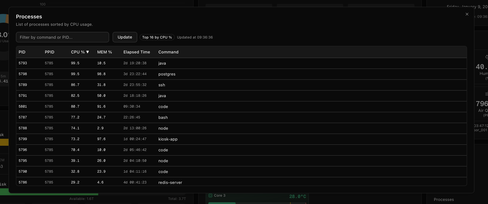
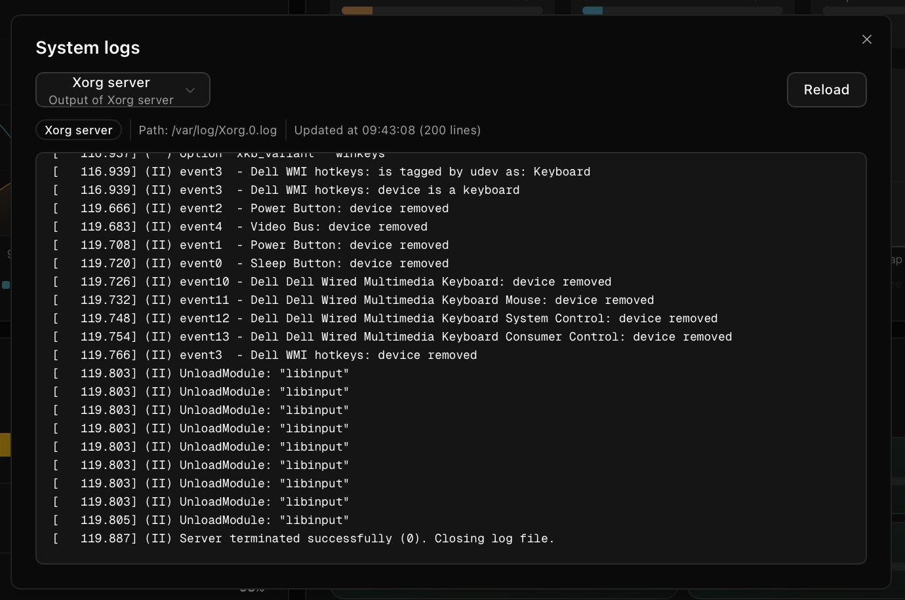
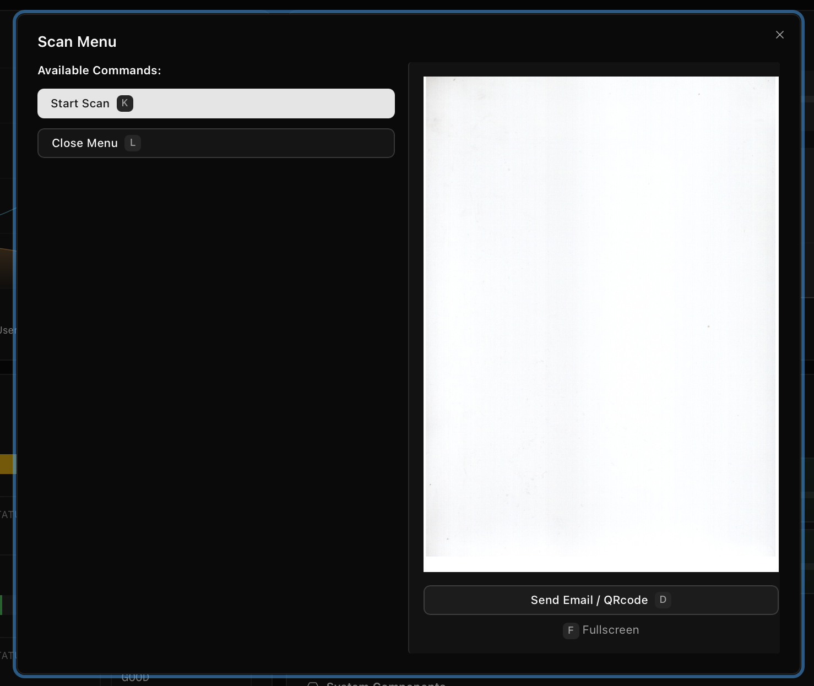

# 🖥️ Server Dashboard



A complete and modern web dashboard for real-time monitoring of server performance


## ✨ Main Features

-  Real-time monitoring of CPU, memory, disk usage, and temperature sensors
-  Hardware sensors integration for temperature, humidity, pressure, and gas levels
-  Document scanner feature with email sending capability
-  Navigate and control the dashboard with keyboard only
-  Process monitoring with resource usage details
-  Logs viewer 
-  Kiosk mode for full-screen display on dedicated monitors
-  Cache Ram usage monitoring and clearing

### 🖥️ Process Monitoring 



View active processes on the server along with their CPU and memory usage.  

### 🗒️ Logs Viewer



Access and view system logs directly from the dashboard.

### 🖨️ Scan Feature

 
Scan documents using a connected scanner and send them via email directly from the dashboard.

## 🌐 Demo
You can try the live demo [here](https://demos.exelvi.xyz/server-dashboard).

> [!WARNING]
> You should use a 1920x1080 resolution

## 🚀 Quick Start

### 🛠️ Prerequisites

-  Node.js v24.x or higher
-  pnpm (recommended) or npm
-  PM2 (optional, for production deployment)

### 🛠️ Hardware Requirements (Optional)

-  Hardware sensors support (for temperature monitoring, I used an Lilygo T-display with an ATH20 + BMP280 and a MQ-125 gas sensor; you can find the code in the `extras/code.ino` folder) 

### 🖥️ Installation

```bash
# Clone the repository
git clone <repository-url>
cd kiosk

# Install dependencies
pnpm install

# Build the project
pnpm build

# Start the server with pm2
pm2 start ecosystem.config.js

# Start the websocket for the environment sensors (optional)
pm2 start pnpm --name sensor-ws -- tsx sensors-ws-server.ts

# Save the pm2 process list and configure it to start on boot
pm2 save

# Or start in development mode
pnpm dev
```

The application will be available at [http://localhost:3000](http://localhost:3000)

## 🌡️ Environment Sensors Setup

To monitor hardware sensors like temperature, humidity, and gas levels, you can use an ESP32 microcontroller with appropriate sensors (e.g., ATH20 for temperature/humidity, BMP280 for pressure, MQ-125 for gas detection).

You can find the Arduino code and PlatformIO configuration in the `extras/code.ino` directory for a Lilygo T-Display board.


## 🖥️ Kiosk Mode

Run the application in full-screen kiosk mode on a dedicated monitor, perfect for server rooms or monitoring stations.

> [!NOTE]
> This setup has been tested on Ubuntu Server

### 🖥️ Requirements

-  A monitor connected to your server
-  Chromium or Firefox browser with kiosk mode support
-  A minimal window manager (like Openbox)

### 1. Install the necessary packages:

```bash
sudo apt update
sudo apt install --no-install-recommends \
  xserver-xorg x11-xserver-utils xinit openbox chromium-browser
```

### 2. Create a dedicated user for the kiosk:

```bash
sudo adduser kiosk
sudo usermod -aG audio,video,tty,dialout kiosk
```

### 3. Create an `.xinitrc` file in the kiosk user's home directory:

```bash
nano /home/kiosk/.xinitrc
```

Add the following lines:

```bash
#!/bin/bash

# Disable screen blanking and power management
xset s off
xset -dpms
xset s noblank

# Wait for X to be fully started
sleep 2

# Launch Chromium in kiosk mode
chromium-browser \
  --noerrdialogs \
  --disable-infobars \
  --disable-session-crashed-bubble \
  --kiosk \
  http://localhost:3000
```

### 4. Make the `.xinitrc` file executable:

```bash
chmod +x /home/kiosk/.xinitrc
```

### 5. Automated login on TTY1

Edit the getty service for TTY1:

```bash
sudo mkdir -p /etc/systemd/system/getty@tty1.service.d
sudo nano /etc/systemd/system/getty@tty1.service.d/override.conf
```

Add the following lines:

```ini
[Service]
ExecStart=
ExecStart=-/sbin/agetty --autologin kiosk --noclear %I $TERM
```

### 6. Apply the changes and enable auto-start of X on login:

```bash
sudo systemctl daemon-reexec
sudo systemctl daemon-reload
sudo systemctl restart getty@tty1
```

### 7. Auto-start startx on login

```bash
nano /home/kiosk/.bash_profile
```

Add the following lines:

```bash
if [[ -z $DISPLAY && $XDG_VTNR -eq 1 ]]; then
  startx
fi
```

### 8. Reboot and verify

```bash
sudo reboot
```

After reboot, the system should automatically:

1. Log in the kiosk user on TTY1
2. Start the X server
3. Launch Chromium in full-screen mode
4. Display the dashboard at `http://localhost:3000`

> [!IMPORTANT]
> Ensure your Next.js application is configured to start on boot using PM2:
>
> ```bash
> pm2 startup
> pm2 save
> ```

## 📦 Available Scripts

```bash
pnpm dev      # Start development server with hot reload
pnpm build    # Build for production
pnpm start    # Start production server
pnpm lint     # Run ESLint code linting
```

## 🏗️ Project Structure

```
kiosk/
├── app/                  # Next.js App Directory
│   ├── api/              # API Routes
│   │   ├── cache/        # Endpoint to clear memory cache
│   │   ├── disk/         # Endpoint to get disk usage
│   │   ├── logs/         # Endpoint to fetch system logs
│   │   ├── stats/        # Endpoint to get CPU, memory stats and sensors
│   │   ├── processes/    # Endpoint to get active processes
│   │   ├── sendMail/     # Endpoint to send scans email
│   ├── components/       # Components specific to app routes
│   │   ├── modals/       # Dialog and modals
│   │   └── utilities/    # Utility components
│   ├── services/         # Scan and demo service
│   └── scans/            # Scanned files route
├── components/           # Components used across the app
│   ├── scanner/          # Scanner components
│   └── ui/               # shadcn UI components
├── hooks/                # Hooks
├── lib/                  # Utilities and helpers
├── pages/                # API Routes for scanner and JWT validation
├── extras/               # PlatformIO configuration with Arduino code, send mail route
└── public/               # Static files
```

## 🔧 Configuration

### Environment Variables

Create a `.env` file in the root of the project with the following variables:

```env
# Mail server configuration (for scanner feature)
MAIL_SERVICE_URL="your_mail_service_url"
JWT_SECRET_KEY="your_mail_server_secret_key"

# Server configuration
HOSTNAME="your_server_hostname"

# WiFi configuration (displayed in scanner QR codes)
NEXT_PUBLIC_WIFI_SSID="your_wifi_ssid"
```

## 🧪 Demo Mode

The application supports a demo mode for testing without requiring real server data or hardware sensors. This is useful for development and testing purposes.

To enable demo mode, add the following environment variable to your `.env` file:

```env
NEXT_PUBLIC_DEMO_MODE=true
```

When enabled, the dashboard will display simulated data for all monitoring features.


## 🔌 API Endpoints

### Monitoring

-  `GET /api/stats` - Fetch CPU, memory usage, and sensor data
-  `GET /api/disk` - Get disk usage information
-  `GET /api/cache` - Retrieve cached sensor data
-  `GET /api/logs` - Fetch system logs
-  `GET /api/processes` - List active processes with resource usage

### 🖨️ Scanner

-  `POST /api/sendMail` - Send scanned documents via email
-  `GET /scans/[file]` - Retrieve a specific scanned file

# [📋 Steps](timeline.md)

# 🤖 AI Usage

AI helped me with code snippets, autocompletion, debugging, bug fixes, formatting raw data and styling suggestions

## 📄 License

This project is licensed under the MIT License. See the [LICENSE](LICENSE) file for details.

<div align="center">
  <strong>Built by EXELVI with ❤️</strong>
</div>
